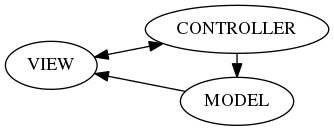

====================================
(LV2) On-board level software design
====================================

Introduction
------------

This documents sets prerequisites for software development for any computer that is installed onboard.

Motivation
==========

On-board computers liaise between Earth-base station and *uC*\ s. Their main purpose is to decode commands received from the remote source and apply it to the specific microcontrollers.

Moreover, some of these computers may perform additional tasks. For instance, *Drive module* is expected to compute basic *SLAM* procedures in order to navigate autonomously.

System overview
---------------

An idea is to send a command from an Earth-base station wirelessly so that a robot responds and sends back feedback. The system comprises of the elements as *uC*\ s, on-board computers and Earth-base computers, which relates to the level\ *ish* software structure.

In general, a user enters a command from an Earth-base station. A command message is encoded and sent wirelessly. The message is then received by the rover placed in a remote location and decoded by one of the on-board computers. Then, the computer has to create an another message so it suits the API provided by the *uC*\ s. The message is sent to the *uC* and decoded there. Finally, a message pipeline results in an execution of the command.

The feedback data uses a very similar pipeline. One of the *uC*\ s create a message that is received by an on-board computer. The computer stores the most recent data into its memory. The feedback data can be sent periodically or requested by a remote client. In any case, the data is wrapped with protocol metadata and forwarded to the Earth-base computers.

.. note::
    Add a graphics related to the pipeline

System requirements
-------------------

Reference table
===============
.. note::
    ID code description:
        * LV? - software level e.g. LV2
        * MODULE - module code e.g DM
        * NNN - reference number
        * T - requirement type e.g. S - *S*\ oftware
        * -SR - System Requirements

+------------------+---------+-------------------------------------+------------+
| #                | Priority| Description                         | Basis      |
+==================+=========+=====================================+============+
| `General Feature - System Requirements`_                                      |
+------------------+---------+-------------------------------------+------------+
| LV2-GF-001-S-SR  | HIGH    | Provide reliable wireless connection|            |
|                  |         | using TCP/IP stack                  |            |
+------------------+---------+-------------------------------------+------------+
| LV2-GF-002-S-SR  | HIGH    | Support Serial Port                 |            |
+------------------+---------+-------------------------------------+------------+
| LV2-GF-003-S-SR  | HIGH    | Discover ID of the *uC*             |            |
+------------------+---------+-------------------------------------+------------+
| LV2-GF-004-S-SR_ | HIGH    | Provide on-board telemetry logging  |            |
|                  |         | system based on SQLite              |            |
+------------------+---------+-------------------------------------+------------+

General Feature - System Requirements
=====================================

This sections handles requirements that cannot be fully described in a reference table. Each of the following subsections comprises of the *ID code* and a concise description.

LV2-GF-004-S-SR
+++++++++++++++
The logging system is a universal system to store sensor data on-board. It is required to provide following features:
    #. Store any key-value pair in a database with a timestamp    
    #. Secure the database against unexpected power loss (only last second of data logging can be lost)    
    #. Provide a separate dynamically loaded library for reusability
    #. Provide easy to use lookup methods
    #. Provide a simple database viewer for the Earth-base station

Software Architecture
---------------------

    *Graphical representation of the Model-View-Controller pattern*
    
The *Model-View-Controller* (MVC) is chosen to be the basis of the software architecture. It provides flexibility of the system as well as separation of the responsibilities. This chapter deals with a general approach to the implementation. Details may very due to complexities related to a particular module.

.. note:: The textbook MVC pattern is often described as a part of a GUI framework. The architecture makes use of the design albeit there is no GUI part. A part that differs from the nominal pattern the most is the *view* and its source of an event input.

Model
=====
A *Model* represents the roots of the system. In general, the model holds all data of the system. The architecture assumes the model provides an abstraction of a real-world system. For instance, it incorporates the real dimensions of the robot to compute inverse kinematics and predict colissions.

The model may be responsible for performing additional computation to finally determine position of an actuator. Once the required parameters are computed the model forwards the data to a microcontroller. The microcontroller executes a command taking into account low-level computations such as PID. If position of an effector changes, the model is notified.

When the model is notified, it receives feedback data from the microcontroller and acts upon it. In most cases, the model will notify all observers if the state changes.

The model is an *Observable* in terms of the Observer pattern. It registers *observer* objects and notifies them as required. An observer in the MVC pattern is a synonym to the *view*.

View
====
A *View* represents user's interaction with the system. In general, it receives events triggered by the user.

A textbook example of the *view* is a GUI window and a bunch of widgets that react to the user's input. The similar happens in the case of the proposed system architecture. The only difference is instead of the GUI the socket connection is introduced.

The *view* is a server that awaits for a connection between a module instance and the Earth-base application. It listens for any remote input. If one connects, the view creates a socket so the connection is established and the data can be conveyed.

The view provides a series of operations that can be shortened to CRUD:
    
    * **C - Create:** A command of this category forces a module to create a new object. For instance, a user wants to drive in an autonomous mode instead of a manual one. This action is the perfect one to choose.
    * **R - Read:** A command of this category requests the newest telemetry data that can be obtained from the related devices.
    * **U - Update:** A command of this category updates the state of the model. It usually means, a user  wants to send a command to any available actuator.
    * **D - Delete:** A command of this type cancels some of the temporary settings received in the *Create* command.

Most often the view is described as the *Composite pattern*. This is not the case. The composite part is the GUI component, which is irrelevant in the proposed architecture. The *view* requires *Strategy pattern* that translates commands received from the user's app to the form that suits best for the model. In other words, the view requires a strategy (the *Controller*) in order to notify the model. 

The *view* is also *Observer* part of the *Observer pattern*. If the model changes it state, it notifies all *observers* thus it notifies the view. The data should be then forwarded to the remote user. Thanks to the *Strategy pattern* and the *view* can create a correct data package and send it to the recipient.

Controller
==========
A *controller* acts as an interpreter of the events retrieved from the view. In general, it receives the data from the view and passes it to the model, in a model-friendly form.

The *controller* is a textbook *Strategy* pattern. It provides an algorithm to parse messages received from the *view* and encode a message if it is required.

The parsing part can be described by the following pipeline::
    
    View -> Controller -> Model
    
The controller defines the way the data is interpreted. For instance, one implementation of the controller can parse a gamepad input. Another one can parse a text input, which may allow a module to script one of functionalities of the robot. Most importantly the controller can be changed in the runtime, which is perfect for a multi-mode operational vehicle such as Mars rover.

Important notes
===============

The MVC pattern can be nested. A model of the top MVC part can be a view of the bottom MVC and so on. Nonetheless, the data flow should remain the same. 

