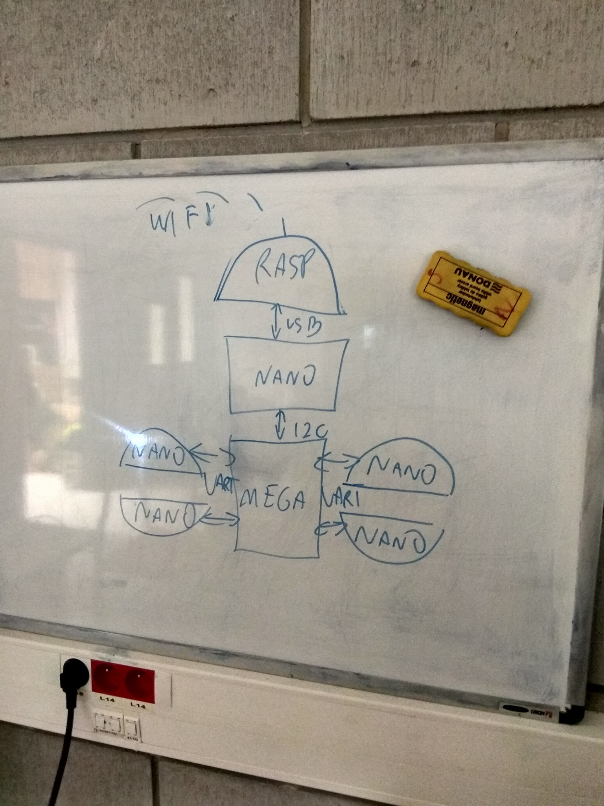

==============================
Zebranie: 2018-01-13
==============================

Zadania w trakcie
------------------
* Krzysiek S.: czujnik wysunięcia segmentu teleskopowego (elektronika)
* Wojciech W.: LV1 i LV2 manipulator (oprogramowanie)
* Bartek S.: LV3 manipulator
* Konrad J.: przenośnik taśmowy i mikroskop (mechanika)
* Agnieszka Z.: płytka pomiarowa (elektronika)
* Karol Koł.: doniczka pomiarowa (elektronika + software)

Przebieg spotkania
------------------
* `Omówienie stanu łazika na teraz`_
* Omówienie regulaminu
* Wyznaczenie wymagań projektowy (use case)
* `Wyznaczenie milestonów`_
* `Przydział prac`_
* `TODO`_

Omówienie stanu łazika na teraz
+++++++++++++++++++++++++++++++
* Sterowniki elektroniczne sprawne bez enkoderów
* Podwozie: kadłub i okablowanie niemal gotowe
* Manipulator: mechanika - 90% done, oprogramowanie 80%
* BMS: 30%
* Komunikacja: 2.4 GHz - prawdopodobnie bez zmian.

Wyznaczenie milestonów
++++++++++++++++++++++

Lamp indicator:
    * Zastosowanie gotowego rozwiązania bazującego na napięciu 220V
    * Przekaźnik będzie odpowiadał za sterowaniem włącz/wyłącz.
    * Instalacja na spoilerze

Bezpieczeństwo:
    * Możliwa instalacja wysokoprądowego hebla do systemu bezpieczeństwa
    * Instalacja zrywki na smyczy

Science task:
    * zbadanie szczelności pojemników - sprawdzić za pomocą bombek dymnych, dwustronnie z udziałem czujnika dymu. Zapytać KradeX o normy szczelności i możliwości badania danego pojemnika.
    * odwiert: 
        * research w dziedzinie inżynierii biomedycznej - wstawianie implantu stawu biodrowego: spróbować zastosować podobne rozwiązanie do stworzenia odwiertu.
        * rurka z poliwęglanu napędzana teleskopową częścią manipulatora z silnikiem od wycieraczek. Wykorzystać części z respiratora. Częścią roboczą zostanie korona do drewna.
        

Maintanance task:
    Wg wymagań regulaminowych zalecana jest informacja zwrotna o położeniu i siłach działających na części manipulatora.    
    
    * wyznaczenie charakterystyki moment obrotowy-prąd na wszystkich możliwych osiach manipulatora
    * w przypadku aplikacji LV3 wyświetlić prąd na czerwono w przypadku przekroczenia limitu.

Przydział prac
++++++++++++++
    * Wojtek: dokończyć software dla manipulatora
    * Patryk: badanie szczelności pojemników + poprawki w projekcie.
    * Bartek: opracowanie protokołu testowego do badania szczelności pojemników, testowania wiertła
    * Marcin: 
        * zakupić wieloosiowy interfejs umożliwiający sterowanie robotem mobilnym
        * przyklejenie modułów DONG (Dynamic Orientation by Normalized Graphics) do kół
        * dokończenie modułu Bełchatów
    * Krzysiek: 
        * przygotować use casy, wrzucić dokumentację (link) jako publiczne dla każdego
        * rozpocząć implementację skryptowania jazdy w module ASS (Automatic Scripted Steering)
        * ukończyć małego Oriona do testów Computer Vision        
    * Agnieszka: zrealizowanie architektury PENIS (Port Extending for Network Integrated Synchronization) dla podwozia

.. warning:: **MILESTONE**

    Kluczowe jest, by podstawowe moduły łazika były zakończone jak najszybciej. Moduł jazdy (wraz modułem PENIS) i moduł manipulatora powinny funkcjonować do końca lutego w trybie podstawowym (sterowanie mocą). Do końca marca obecne powinny być enkodery, by rozpocząć testy jazdy autonomicznej (co najmniej akwizycja danych do celów ich przetworzenia).

    Rysunek poglądowy reprezentujcy architekturę PENIS.

.. note::
    * Pamiętaj o częsciach zapasowych do napędów

TODO
++++

* Zebranie statystycznie znaczącej ilości danych pomiarowych do stworzenia `filtru Kalmana <https://en.wikipedia.org/wiki/Kalman_filter>`_\ .
* Opanowanie kwaternionów oraz Jakobianów dla implementacji kinematyki odwrotnej w łaziku.
* Zbadanie możliwości sieci WiFi 5.6GHz
* Stworzenie procedur testowych dla elementów (tekst, protokół badań):
    Testy powinny zostać precyzyjnie opisane. Należy podać warunki początkowe, opis warunków atmosferycznych oraz wszelkie przydatne dane, które wspierają proces tworzenia badań naukowych. Cel badań powinien zostać jasno zdefiniowany oraz zaprezentowane wnioski wstępne.

    * Moduł jazdy (testy akceptacyjne, wytrzymałości elementów, próba obciążeniowa)
    * Skuteczność operowania manipulatorem z kinematyką odwrotną i bez
